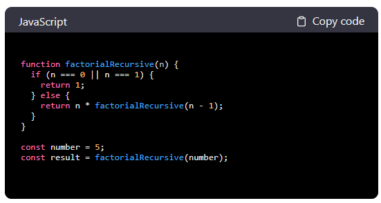

# vue3-highlight-component

### Description

With vue3-highlight-component, you can highlight code blocks within your application using  the power of [Highlight.js](https://highlightjs.org/).
In addition to supporting multiple programming languages, the component can be customized with different props to match the design of your application.

### Installation
```
npm i highlight.js vue3-highlight-component
```

## Example



### Basic Usage

```vue
<template>
  <HighLight  :with-header="true" language="js" header-language="JavaScript"  :code="code"/>
</template>

<script>
import hljs from 'highlight.js'
import HighLight from "vue3-highlight-component";

// Register the language if it's not supported by default
hljs.registerLanguage('js', require('highlight.js/lib/languages/javascript'))

export default {
  name: 'App',
  data() {
    return {
      code: `your js code...`
    }
  },
  components: {
    HighLight
  }
}
</script>
<!-- you can choose alot of diffrent styles from highlight.js/styles in your node_modules -->
<style src="highlight.js/styles/panda-syntax-dark.css"></style>
```


### Props

|   Name   |  Type  | Description  |      Required      |      Default      |
| :------: | :----: | :---------: | :-----------------: |:----------------: |
| code | String |  The text of the code displayed by the component  | **✔️** ||
| language | String |  The language of the code (is optional since highlight.js could automatically infer the language if it's not set.) | **❌** | highlight.js output|
| withHeader | Boolean |  For headers with language name and copy option set to true. |**❌**   |false|
| copyText | String | If you would like to add custom text to the copy option . Only relevant if withHeader is set. |  **❌** |Copy code|
| copySuccessText |  String | If you would like to add custom text to the success copy (Following the copy option click) . Only relevant if withHeader is set. | **❌** |Copied!|
| headerLanguage | String | If you want the language displayed in the header to have a custom name. Only relevant if withHeader is set. |  **❌** |dispaly the props language|


#### on [npm](https://www.npmjs.com/package/vue3-highlight-component?activeTab=readme)

